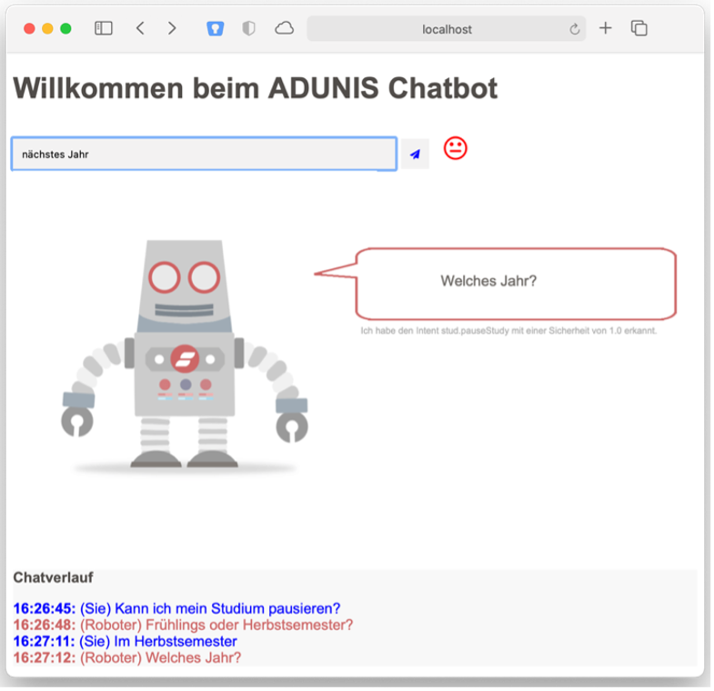

# Adunis Chatbot

A prototype chatbot for student advising. This project uses Google Dialogflow.

The application was created for the AI-Foundations Module at the Eastern Switzerland University of Applied Sciences.



## Setup Environment

To run the application, the environment-key "GOOGLE_APPLICATION_CREDENTIALS" has to be set:

```
GOOGLE_APPLICATION_CREDENTIALS=/path/to/google-api-credentials.json
```

